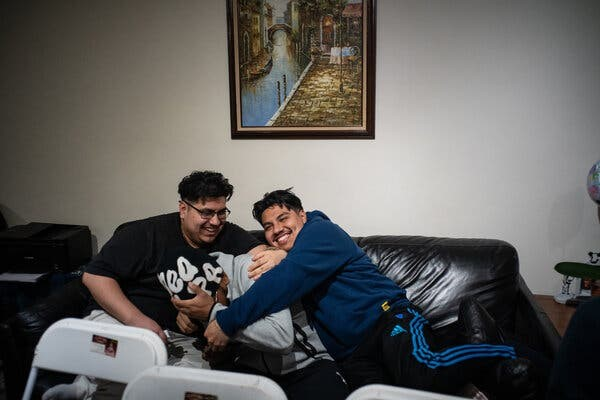
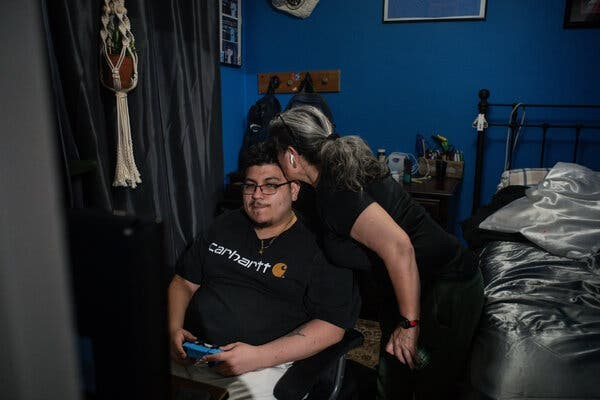
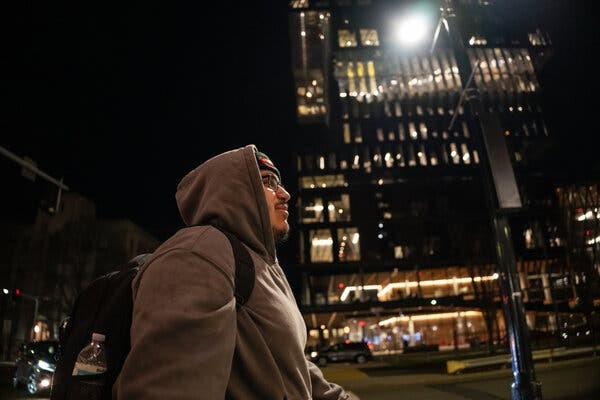
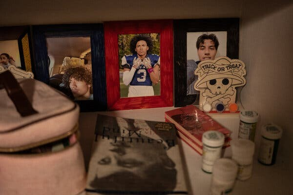
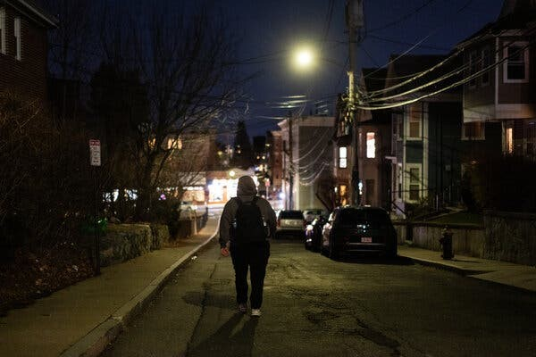

# 📰 Featured in The New York Times  

I had the incredible opportunity to be featured in *The New York Times* article, ["24, and Trying to Outrun Schizophrenia"](https://www.nytimes.com/2024/12/30/health/schizophrenia-early-intervention-treatment.html). The article highlights the immense challenges that individuals with schizophrenia face—challenges that often make it difficult to maintain stability, pursue education, or achieve career goals. Schizophrenia is a condition that affects cognition, perception, and emotional regulation, and for many, it can be a barrier to leading an independent life. The statistics paint a harsh reality: many who are diagnosed struggle with employment, education, and personal well-being.  

Despite these challenges, I refuse to let schizophrenia define my future. Instead of becoming a statistic, I am pushing forward, proving that with perseverance, the right support system, and a relentless drive, it is possible to defy the odds. My passion for **computer science, data analytics, and machine learning** has driven me to excel academically and professionally. From earning my degree at **Syracuse University** to pursuing my **Master’s in Applied Data Analytics at Boston University**, I am continuously working toward breaking barriers in the tech industry.  

Mental health conditions like schizophrenia often come with societal stigma, misconceptions, and underrepresentation in fields like **STEM**. By sharing my journey, I hope to inspire others facing similar challenges to recognize their own potential, seek the support they need, and pursue their dreams unapologetically. My story is not just about overcoming adversity—it’s about reshaping narratives, challenging expectations, and proving that success is possible no matter the obstacles.  

---

# 🗞 Full Article: *“24, and Trying to Outrun Schizophrenia”*

**Written by Ellen Barry**
**Photographs by Todd Heisler**  
**Originally published in The New York Times, December 30, 2024**

> **Note: Full article reproduced with permission from Ellen Barry.**

Kevin Lopez had just stepped out of his house, on his way to meet his girlfriend for Chinese food, when it happened: He began to hallucinate.
It was just a flicker, really. He saw a leaf fall, or the shadow of a leaf, and thought it was the figure of a person running. For a moment, on a clear night last month, this fast-moving darkness seemed to hurtle in his direction and a current of fear ran through him.
He climbed into the car, and the door shut and latched behind him with a reassuring thunk.
“It’s nothing,” he said. “I don’t know why — I think there’s a person there.”
Light had always caused problems for Kevin when symptoms of schizophrenia came on. He thought that the lights were watching him, like an eye or a camera, or that on the other side of the light, something menacing was crouched, ready to attack.
But over time, he had found ways to manage these episodes; they passed, like a leg cramp or a migraine. That night, he focused on things that he knew were real, like the vinyl of the car seat and the chill of the winter air.
He was dressed for a night out, with fat gemstones in his ears, and had taken a break from his graduate coursework in computer science at Boston University. A “big bearish, handsome nerd” is the way he styled himself at 24.

{fig-align="center" width="100%"}

For the past four years, Kevin has been part of a living experiment. Shortly after he began hallucinating, during his junior year at Syracuse University, his doctors recommended him for an intensive, government-funded program called OnTrackNY. It provided him with therapy, family counseling, vocational and educational assistance, medication management and a 24-hour hotline.
Such programs — there are around 350 in the United States — challenge the old idea that psychotic disorders are degenerative, a long slide to permanent disability. They operate on the notion of a golden hour. By wrapping a young person in social supports early on, the theory goes, it may be possible to prevent the disorder from advancing.
In the years that followed, Kevin’s OnTrack team shaped his life in profound ways: by assuring officials at Syracuse University that he was well enough to return and finish his degree; by persuading Kevin’s mother that it was safe to let him return to college; by relieving the everyday stresses that could set off psychosis. Sometimes, when Kevin argued with his girlfriend, he would put his OnTrack therapist on speakerphone.
But now, after four years, his time in the program was up. An estimated 100,000 people experience a first episode of psychosis every year, roughly four times the number of spots available in early intervention programs. So in December, it would all go away: the team of five providers and the hotline and the therapist who reminded him of his mother.
What would happen to him without their support? Even as enthusiasm for early intervention builds, long-term studies are casting doubt on whether its benefits last after discharge. For Kevin, leaving the program meant a sudden blast of autonomy and a million questions about what his future, with schizophrenia, would look like.
“The training wheels are coming off,” he said.

{fig-align="center" width="100%"}

## New Hope for Psychosis

In October 2020, Kevin was in a psychiatric hospital in White Plains, N.Y., miserable and confused.
Strange things had begun to happen to him over the summer, as he prepared for his junior year at Syracuse. Voices were saying vile things through the walls. He heard gunshots at night. He heard his brother Diego screaming — which was impossible, since Diego was in Brooklyn — and called home, desperate to save him.
For the first time in his life, Kevin was flunking classes — bizarre for a math nerd and high school salutatorian. In his fraternity house, he would take offense at insults that nobody else could hear. By the time his mother persuaded him to see a psychiatrist, he was sick with panic, convinced that malevolent forces were hunting him down.
Too afraid to climb into an Uber, he walked the whole way, darting around buildings to hide from the helicopters he thought were following him. When he reached the office, the doctor looked at him with concern. When she asked what was going on, he told her: “They’re coming, they’re coming.”
“And then,” he recalled later, “I just started crying because I couldn’t form a sentence.”
The diagnosis of schizophrenia felt like, as he put it, “the end of everything for me.”
Kevin knew about this disease because his uncle, Marco, had it. Tio Marco lived on disability benefits. He had never held a job or had a romantic partner. This is not unusual; a Swedish study found that five years after diagnosis, only 10 percent of people with schizophrenia were employed. The median long-term recovery rate, according to a 2013 meta-analysis, was 13.5 percent.
Early on, when Kevin was numbed by the effects of antipsychotic medication and sleeping most of the day, he thought that might be his life, too. “I thought I was going to be stuck like that forever,” Kevin said. “Because I saw my uncle.”

{fig-align="center" width="100%"}

But a new idea was rippling through psychiatry, and that fall, it reached Kevin.
It traced back four decades to Melbourne, Australia, where a psychiatrist named Patrick McGorry had erupted in frustration at the grim prognosis given to young people newly diagnosed with schizophrenia. Stripped of any hope of recovery, they were offered a standard treatment: nursing care and “very high doses” of antipsychotic medications.
In 1984, Dr. McGorry opened his own clinic and tried to do it differently. He encouraged his young patients to stay in school and offered a package of services heavy on talk therapy. He prescribed antipsychotic medication, but at “the lowest effective dose,” to minimize side effects. He compared this approach to treatments for cancer or diabetes: Careful treatment at the earliest stage, he said, could “bend the curve” of the disease.
Large trials bore out Dr. McGorry’s optimism. Patients enrolled in early intervention programs reported fewer symptoms. They were less likely to be rehospitalized and more likely to keep working or stay in school. Gradually, the whole field of schizophrenia began to shift. In 2014, Congress began earmarking funds for states to establish programs for first-episode psychosis, to be provided at no out-of-pocket cost to patients.
Kevin was still in his hospital bed when he was referred to an OnTrack team based at the Institute for Community Living in Brooklyn — five providers who would stay with him through the early years of the disease.
At first, they urged Kevin to leave his mother’s apartment every day, even if it was just as far as the lobby. Thomas Grant, a psychiatric nurse practitioner, was on call to adjust his medication. Stoop Nilsson, a team leader, insisted that he sit with uncomfortable emotions. His peer specialist was “just like a homie.”
And one of them, a therapist named Maria Espin, became the person he turned to when he felt the hurricane of symptoms whip up around him.

## Wrapped in a Blanket

{fig-align="center" width="100%"}
 
It was after 1 o’clock in the morning when Maria’s phone began to ring. She swung her legs out of bed, padded to her dining room, and opened her laptop, still in her pajamas.
On the other end of the line was Kevin, now back at Syracuse and living in a rented room, hallucinating. At first, he was so anxious that he could not speak, but she could hear him breathing heavily and pacing.
His thoughts were racing. Worries had crashed in on him in the middle of the night — that his girlfriend no longer loved him, that she was planning to break up with him. A voice was telling him to grab the lamp by the side of his bed, to wrap its cord around his neck.
“Can we remove that lamp and put it in the closet?” Maria asked him. Kevin did as she suggested. In her quiet voice, she talked him through grounding exercises that drew his attention to the physical world around him. Could he name five things he could see at that moment? Four things he could touch? Three things he could hear?
That night, Maria recalled, she stayed on the line with him for nearly two hours. When he was ready, Kevin would climb into an Uber and go to the emergency room. But it would be calm. There would be no ambulance, no emergency injection, no four-point restraints. And two days later, Kevin would be back in class, just another undergraduate studying for exams.
Bit by bit, Kevin pieced together a life that accommodated schizophrenia.
He scheduled his classes around the engulfing sleep that followed each dose of medication; he adjusted to a 100-pound weight gain, another side effect, and still performed his fraternity’s synchronized line dances. At an after-party during his junior year, he met Raquel Guardado, a sophomore with almond-shaped eyes and a family nearly as loud as his own. (“I’m a yapper,” she said. “I like to talk a lot.”)
He told Raquel about his diagnosis the second time they hung out, and she didn’t hesitate. He was a comforting presence; when she walked across campus with him, every other person they passed said hi. The fact that he went to therapy struck her as an unambiguous good. “I was never scared,” she said. “Just more of, I don’t know what is in store for me.”
They were together in her room this May when he pulled up his final grades on his laptop: He had passed his most difficult class, operating systems, and that meant he would graduate. When Kevin received his Bachelor of Science degree, his family crowded around him on the steps of Hendricks Chapel, beaming.
Two hundred and fifty miles away, his OnTrack team celebrated, too.
“Everybody thought that he was not going to make it, that he was going to drop out and come back home and work somewhere, like a part-time job,” Maria said. “That’s basically what a lot of people would have said. But he did not.”
A Basement Room in Boston

{fig-align="center" width="100%"}
 
Four months later, Kevin moved to Boston, where he had been admitted to a master’s program in applied data analytics at Boston University Metropolitan College.
The team had kept Kevin in the program longer than the usual two years. This was partly because he had persistent thoughts of self-harm; he had been on their list of high-risk cases for years. But Maria felt that it was the right time to discharge him. His serious episodes were less and less frequent — and besides, the team had been turning away referrals for months.
“The model of the program is you start meeting them less and less, to give them that space, that empowerment, to be able confront things on their own,” said Maria, a primary clinician at the Institute for Community Living.
What this means for Kevin is not clear. Research studies suggest that the benefits of early intervention, clearly demonstrated at two years, are not sustained over the long term. A 2019 review of long-term outcomes found that a range of improvements — lower hospitalization rates, symptom reduction, full-time employment — began to fade after the services ended.
By the 10-year follow-up, “really all the effects wash out,” said Nev Jones, an associate professor at the University of Pittsburgh’s School of Social Work who researches early intervention. This should not come as a surprise, she added.
“If you look at what early intervention is, it’s not some miracle cure — it’s very, very high-quality, holistic, coordinated services,” Dr. Jones said. “As long as you’re providing these very high-quality, coordinated services, you’re going to see better outcomes. Take them away, and people aren’t just going to maintain that over time.”
Most participants need long-term help with career development if they are to move out of poverty, she added. “We don’t take people who are in wheelchairs, send them out of the hospital and say, Figure it out on your own,” she said.
Dr. Lisa Dixon, who has directed New York’s OnTrack program since its inception, agreed that discharging participants into the broader health care system can be rocky because, as she put it, “it’s so hard to get services.” Often, she said, patients return to report that they cannot even find a psychiatrist.
But two years, Dr. Dixon said, may be enough to provide people with a “great start to their life.” As that period ends, she added, “we want to be minimizing the resources needed and the dependence on professional care,” seeking the lowest level of services that the person needs.
“I’m going to be an optimist,” she said. “We have tons of work to do. But if you can get through the first two years of this experience and feel like you have a future and have a sense of personhood, and you can be somebody — what a difference.”

## Pushing the Limits

{fig-align="center" width="100%"}

In Boston, Kevin blended in a neighborhood of 20-somethings with nose rings and flip-flops. He rented a basement room for $800 a month, propping up two rows of framed family photographs opposite his bed.
He and Raquel were approaching their second anniversary. At dinner with friends, she bragged about Kevin’s ease with complex mathematics. As they waited for an Uber to take them home one night, he stood behind her on the curb, his arms wrapped around her, so big that he seemed to envelop her.
He liked to daydream about the future, when they would be “a typical family in a nice house,” like the one in which Raquel’s family lived, in Lynn, Mass. He would work from home, and in the evening, he would rise from his desk, stretch his back and play with their children in the yard. Raquel, who was familiar with this vision, rolled her eyes.
“Lynn is not your dream, honey,” she said. “Please.”
Privately, though, worries were eating at him. He was living on $300 in food stamps a month. His classes weren’t hard, but he often slept until midafternoon, straight through job interviews, therapy appointments, classes. He attributed this to his antipsychotic medication, which “makes me sleep more and more and more and more,” he said.
To counteract this, Kevin cut his dose in half, which made him less sleepy. Sometimes, if he had an important test, he would skip his dose altogether, “just to push the limits.” He hadn’t consulted his team about this, but, he reasoned, the time had come for him to start solving his own problems.
“I can’t stay in OnTrack forever,” he said.
Three months after moving to Boston, he still had not found a new psychiatrist or therapist. Maria kept nudging him about his insurance paperwork, trying to set up an intake appointment, but November passed, and then December, and it didn’t happen. Increasingly, when he had sessions scheduled with Maria, he wouldn’t show up.
At times, Kevin felt his symptoms tick up. Lying in bed, shortly after the move, he saw light seeping through the window and began to think someone was watching him from outside, ready to smash through the glass. One night, when he was particularly agitated, he frightened Raquel and she burst into tears, which made him feel awful.
The truth was, he missed Maria. She was a unique figure in his life, he said: comforting, like his mother and girlfriend, but never disturbed to see him in an episode of psychosis. “The one person in my life,” he called her — “a woman who was not scared.”

## Tiny Cameras Staring

{fig-align="center" width="100%"}

Two weeks before his scheduled exit from OnTrack, Kevin awoke to a rush of symptoms. Later, he would unpack the reasons that had happened: He had taken his medication late, around 5 a.m., and had barely slept when Raquel left for work two hours later. They argued, and he was left alone, swimming in catastrophic thoughts.
Now there were so many shadows that he was afraid to leave his room. He twisted in bed, trying to block out the light that was coming through the window. But when he closed his eyes, he saw tiny points of light and it felt like they were tiny cameras, staring at him.
Kevin caught a glimpse of himself in a mirror and saw something terrifying. And he heard voices: The photographs of his family, lined up on a shelf opposite his bed, began to speak to him, one after another.
In these moments, he needed a person to sit with him, to help him identify what was real and what was not. In the past it was Maria, or his mother, or Raquel. This morning, alone in the basement room, he texted the only other person he could think of, the New York Times reporter who was following him.
“I’m getting symptoms,” he wrote. “Can you come and record.”
When I arrived, Kevin was jittery. I sat there as he paced, did push-ups against the wall, practiced the grounding exercises Maria had taught him. His thoughts raced — did he have an exam tonight? Should he be studying? Every time he seemed to be drifting off, he caught a glimpse of his nose in his peripheral vision and it looked strange, distorted. He kept thinking that if he allowed himself to sleep, he might become paralyzed.
But then he ate a sandwich and settled. An hour passed, and he fell into a deep sleep.
When he awoke, later that afternoon, the hallucinations were gone. Raquel had texted, apologetically. It was the first time he had managed an episode without his support system, and this seemed like a milestone. He felt the relief — euphoria, almost — of passing through something painful and emerging in one piece.
“I feel it, I hear it, I see it,” he said. “And then it goes away.”

## A Goodbye

{fig-align="center" width="100%"}

Kevin saw his OnTrack team one more time. They gathered on Zoom on a December afternoon, and each of them said a few words about the distance he had traveled since his first episode.
Stoop, the team leader, noted how therapy had changed Kevin — how he allowed his feelings to wash over him, even when they frightened him. Maria praised his willingness to ask for help. Diego, his younger brother, talked about how strong he was and choked back tears. “You have been fighting this whole time,” said Thomas, the nurse practitioner. “Just know that we’re always fighting with you.”
One after another, they assured him that he was ready to go on without them.
“This is it,” Thomas said. “You completed the program. This is what recovery looks like.”
Kevin had logged into the meeting from bed, propped on one elbow in the bedclothes. The night before, he had skipped his medication, hoping it would help him wake up to study for his final exams. Still, his body’s need for sleep was overwhelming. He was a month behind on his rent, and empty pizza boxes were piling up in his room.
By the time Kevin left home for campus, though, his head had cleared. Christmas lights were twinkling on Washington Street, and around him, students were clearing out for the holidays, wheeling their suitcases behind them. He found a seat in the back of the bus, just another graduate student in a hoodie, pausing at the edge of adult life.
Earlier, considering how Kevin would navigate the coming years, Raquel had called it “uncharted territory,” and that seemed right. It was night now, and the bus slid by the lighted interiors of nail salons and noodle shops where families were settling down to dinner. Kevin peered out into the dark and wondered what was next.

{fig-align="center" width="100%"}

---

**Ellen Barry** is a reporter covering mental health for The Times.
**Todd Heisler** is a Times photographer based in New York. He has been a photojournalist for more than 25 years.

A version of this article appears in print on Dec. 31, 2024, Section D, Page 1 of the New York edition with the headline: Keeping Schizophrenia at Bay.

---

### 📸 Photo Credits

Images by Todd Heisler. All photos used with permission from *The New York Times*.  

---
